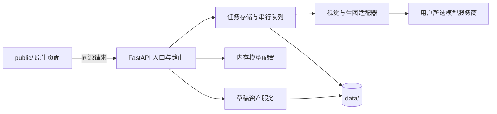

# FastAPI 与 Google 风格规范迁移设计

> 日期：2026-10-05。本文是已确认的迁移目标设计；当前运行实现仍是 Node.js。

## 目标与已确认决策

把本机单用户商品详情图生成器的服务端迁至 Python 3.11 和 FastAPI，最终只保留 Python 服务。保留现有原生 HTML、CSS、JavaScript 页面及其用户操作流程，前端代码按 Google 对应风格指南整理。迁移分模块进行，先在独立端口验收，再切换 `127.0.0.1:8765`。现有 `/api/*` 路径、请求与响应字段、状态码和本机草稿/任务数据必须继续可用。

验收以现有 15 项 Node 测试覆盖的行为为基线：上传与图片校验、模型角色与 SK 隔离、图片进入模型请求、任务持久化与恢复、局部失败、单模块重试、取消、导出与删除。真实服务商连接仍须由用户用自己的 SK 单独验证；模拟服务商通过不能视作真实平台通过。

本次不增加多人账户、远程部署、数据库、Redis、新生图服务商或 TypeScript 构建流程。现有 OpenSpec 变更 `generate-product-detail-images` 中的真实 SK 验证任务保留独立状态，不并入迁移验收。

## 当前系统与迁移边界

当前 `server.js` 和 `server/` 提供 Node HTTP 服务，`public/` 页面调用同源 `/api/*`，`data/drafts/<uuid>/` 与 `data/jobs/<uuid>/` 保存 JSON 和图片。模型 SK 仅在服务进程内存中。任务队列全局并发为 1，服务重启后未完成任务进入 `waiting_credentials`。迁移只改变实现语言与内部结构，不改变这些对用户可见的约定。

FastAPI 开发阶段使用独立端口与临时数据目录；Node 继续服务现有页面。两个服务不得同时写同一个生产 `data/`。切换时先停止 Node，再备份静止的生产数据，使用 Python 3.11 环境验证旧数据读取和任务恢复，然后让 FastAPI 独立监听原端口。保留可执行的回退步骤，确认切换后再移除 Node 服务代码和依赖；已完成迁移后仓库只提供 Python 启动方式。

## 目标架构与组件边界

| 单元 | 职责与边界 |
| --- | --- |
| `backend/main.py` | 应用工厂、生命周期、同源静态文件白名单、统一错误映射；测试可注入数据目录和 HTTP 客户端。 |
| `backend/api/` | 草稿、模型设置、任务、兼容接口的 `APIRouter`；只做请求解析和响应转换。 |
| `backend/services/` | 资产校验与缩略图、内存角色配置、任务存储/队列、提示词和 ZIP 导出。 |
| `backend/providers/` | OpenAI 兼容视觉、Claude 原生视觉、OpenAI Images Edits、生文案调用及服务商错误分类。 |
| `backend/schemas/` | 请求与响应模型，Python 内部用 `snake_case`，对外使用现有 camelCase 字段。 |
| `public/` | 保留三页和原生 JavaScript；仅为风格、共享预设读取和必要兼容修复修改。 |

服务由单个 Uvicorn worker 运行，保持内存 SK 与串行任务队列的单进程语义。FastAPI 生命周期负责启动时恢复任务、启动草稿过期清理并在退出时停止队列。模型 HTTP 请求可注入模拟客户端，生产调用使用显式超时与取消信号。服务商预设保留现有选项、角色限制和可编辑模型 ID；共享预设数据由一个不含密钥的源文件供服务端和前端使用，避免两处维护分歧。

## 数据流与兼容契约

1. `POST /api/drafts` 创建草稿；`POST /api/drafts/{id}/images` 接收字段名为 `image` 的 multipart 上传。服务端按实际内容解码，只接受 JPEG/PNG/WebP，每张最多 10 MB、每草稿最多 6 张，限制解码像素并生成 WebP 缩略图。上传和打开设置页不调用外部模型。
2. `GET/POST /api/roles` 和兼容模型接口继续使用现有 JSON 结构。SK 只在 Python 进程内存中；公开响应只给 `hasKey`、测试状态等非秘密字段。`POST /api/roles/test` 只发送内置测试图。
3. `POST /api/assist-copy` 才把草稿原图和输入资料交给视觉模型。失败时页面保留用户原文。`POST /api/jobs` 复制原图到任务目录，保存资料、设置、模块顺序和模型非秘密快照，返回现有 `jobId` 与状态。
4. 单进程队列按任务、模块顺序执行：视觉分析一次，然后每模块规划文案并生成结果图。每个结果独立落盘；失败模块不清除成功图片。结果页沿用轮询、下载、取消、重试和删除接口。取消阻止后续模块；单模块重试只重新请求该失败模块。
5. 旧 `draft.json`、`job.json` 的文件名、目录、时间戳单位、状态值和 camelCase 字段保留。Python 读取既有文件并写回同一版本格式。写入采用临时文件加原子替换，并按任务 ID 串行化。重启时进行中的任务变为 `waiting_credentials`，运行中模块回到 `pending`；重填与快照匹配的配置后继续，已完成模块不重做。

必须覆盖 README 中列出的现有草稿、模型、任务、结果和旧文本兼容接口，包括图片/ZIP 的 MIME 类型、失败时的 HTTP 状态与 `{ "error": "...", "code": "..." }` 可选错误码。保留现有页面依赖的字段；内部类型化不应让 FastAPI 默认的 422 响应破坏既有错误契约。

## 错误处理与安全

服务仅监听 `127.0.0.1`，校验 Host 与 Origin，静态文件按白名单发送；`data/` 不进入静态目录。路径参数先验证 UUID，再构造文件路径。图片按内容验证并限制大小和像素，失败上传清理临时文件。服务商错误区分鉴权、模型不存在、能力不足、限流、超时、网络和无效响应；外部返回 200 但图片不可解码时，该模块记录失败且不展示伪成品图。错误响应、日志、任务元数据和 ZIP 不包含 SK。

Python 单进程队列在重启期间会中断运行中的请求，因此持久化状态和启动恢复是必要条件。生产 `data/` 切换只允许一个后端写入，备份与回退前检查文件完整性。保持现有用户可见发送提示：仅用户点击 AI 帮写或生成后发送商品资料与图片，连接测试发送内置测试图。

## Google 风格与可重复检查

- Python 遵循 [Google Python Style Guide](https://google.github.io/styleguide/pyguide.html)：模块绝对导入、类型注解、Google 格式文档字符串、命名和异常规则；使用其推荐的 Pylint 配置，并运行 Pyink 格式检查。项目声明 Python 3.11 运行范围。
- 原生 JavaScript 遵循 [Google JavaScript Style Guide](https://google.github.io/styleguide/jsguide.html)，HTML/CSS 遵循 [Google HTML/CSS Style Guide](https://google.github.io/styleguide/htmlcssguide.html)。JavaScript 指南已停止更新，但本次按用户选择保留 JS；用静态检查加人工审查覆盖可自动与不可自动判断的条款。
- 现有压缩为少数超长行的 CSS、JS 将整理为可审查格式，保持页面交互和布局。每项风格例外需记录具体规则与原因，不能用大范围禁用掩盖问题。提供一条可复现的本机检查命令，执行格式、静态检查和测试。

## 验收、切换和完成标准

1. Python 3.11 环境可按 README 从干净检出安装并启动；Python 3.9 不被误用。最终启动流程不依赖 Node。
2. pytest 覆盖现有 15 项 Node 测试对应的关键行为，并使用本机模拟服务商验证图片字节、认证头、错误分类、任务恢复和结果导出；对照测试验证关键 `/api/*` 请求/响应与旧数据兼容。
3. 首页、设置页、结果页在浏览器完成上传、模型配置、AI 帮写、生成、局部失败重试、取消、下载和删除；风格整理后页面布局和交互保持可用。
4. Google 风格检查和人工审查通过；`README.md`、`docs/system-design.md`、验证记录与 OpenSpec 任务状态更新为实际 FastAPI 实现。
5. 切换后使用旧草稿和任务样本验证读取及恢复；Node 服务文件、Node 依赖与旧启动命令移除。真实 SK/真实服务商的最终验证仍由用户在自己的账户执行并独立记录。

## 开发流程

本设计承接 Grill Me 式逐项澄清和 Superpowers 的分段设计审阅。确认本文后，以独立 OpenSpec 变更维护中文 proposal、design、delta specs、tasks；Superpowers 实施计划把每项任务拆成先失败测试、最小实现、验证与提交。迁移期每个模块完成后运行契约测试；最终执行完整验证和切换检查。既有 `generate-product-detail-images` 变更继续记录其尚未完成的真实 SK 验证，不被本迁移变更覆盖。
