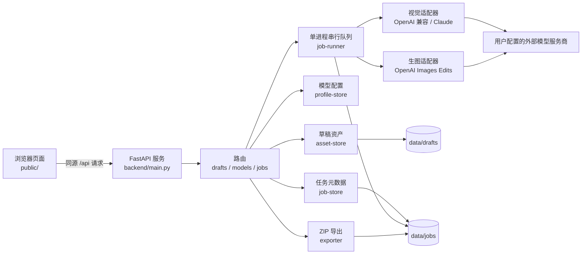
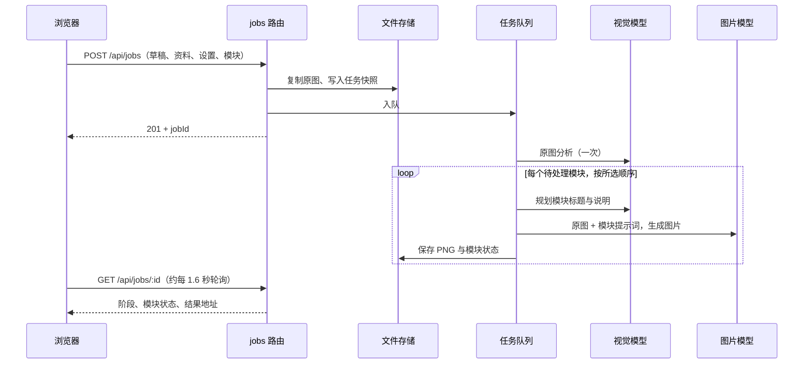
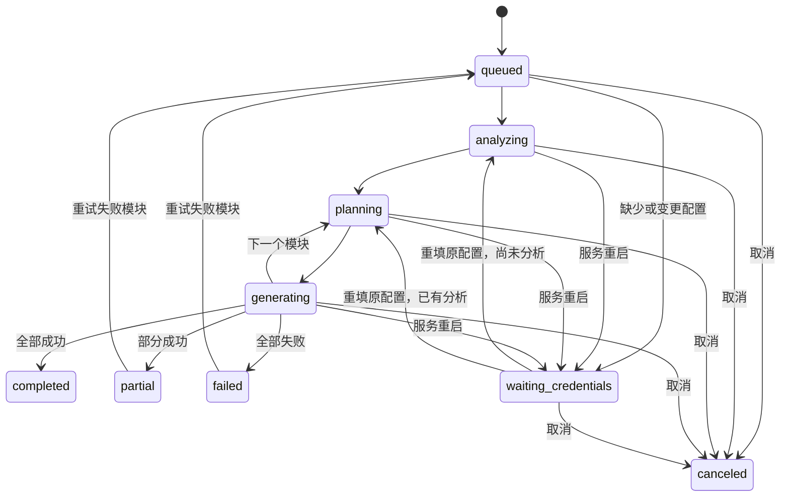

# 商品详情图生成器：系统设计

> 版本：2026-10-06。本文描述当前代码实现；需求与变更过程见 `openspec/changes/generate-product-detail-images/`。

## 1. 目标与边界

系统面向本机单用户：上传同一商品的原图，填写已知资料，选择详情页模块，由视觉模型分析原图，再逐模块生成文案和成品图片。用户可以查看进度、审阅结果、仅重试失败模块、下载图片或 ZIP，并删除本机资产。

当前部署是一个监听 `127.0.0.1:8765` 的 Python 3.11 / FastAPI 进程（单个 Uvicorn worker）。页面为原生 HTML、CSS、JavaScript；服务端使用文件系统保存草稿和任务，不依赖数据库、Redis 或云存储。系统不提供多人账号、远程访问、自动发布到电商平台，也不保证模型输出完全符合商品事实或外观。

Python 存储层 `backend/job_store.py` 已沿用旧 `jobs/<uuid>/job.json` 格式：保留 camelCase 字段、毫秒时间戳、额外字段及已完成图片；恢复进行中任务为 `waiting_credentials`、运行中模块为 `pending`。同一任务的更新和删除串行化，JSON 通过临时文件与原子替换写入，文件占用时有限重试。运行时已切换为 Python，开发与测试使用隔离数据目录。切换当天真实生产 data/ 为空，旧格式恢复通过合成样本验收；详见 docs/fastapi-cutover.md。

## 2. 总体架构



| 层 | 主要代码 | 职责 |
| --- | --- | --- |
| 页面 | `public/index.html`、`settings.html`、`results.html` 及对应脚本 | 上传与配置、触发操作、轮询任务和展示结果 |
| HTTP 入口 | `backend/main.py` | 监听本机地址、限制 Host/Origin、分发 API、按白名单提供静态文件 |
| 路由 | `backend/api/` | 参数校验、请求与响应、草稿/模型/任务操作 |
| 业务服务 | `backend/asset_store.py`、`job_store.py`、`job_runner.py` 等 | 资产、配置、任务存储、队列、提示词与导出 |
| 服务商适配 | `backend/providers/` | 构造外部请求、解析响应、中断异步请求并限制超时、错误分类 |

浏览器不直接持有模型 SK，也不直接调用外部模型。生产进程使用生命周期管理的 `httpx.AsyncClient`；测试通过 `create_app(data_dir, transport)` 注入临时数据与模拟传输，端到端测试使用真实本机 HTTP 模拟服务商。

## 3. 关键流程

### 3.1 上传与 AI 帮写

1. 浏览器创建草稿并把每张图片作为 `multipart/form-data` 上传到本机 API。上传本身不调用外部模型。
2. 服务端按图片内容解码，只接受 JPEG、PNG、WebP；每张最多 10 MB，同一草稿最多 6 张，并生成最长边不超过 400 像素的 WebP 缩略图。
3. 浏览器把草稿 ID 保存在 `localStorage`，刷新后通过 `GET /api/drafts/:id` 恢复预览。
4. 用户点击“AI 帮写”时，服务端读取草稿原图，连同输入资料发送到当前视觉模型。返回已知事实、待补充项和可编辑文案；请求失败时前端保留原文。

### 3.2 创建与执行生成任务



任务创建时固定原图副本、商品资料、平台、市场、语言、质量、比例、风格、模块顺序，以及两个角色的服务商、Base URL、模型 ID。**SK 不进入任务快照**。队列全局并发为 1，任务内模块串行。原图分析生成事实和未知项；文案提示词要求未知信息写“待补充”；图片生成使用原图作为编辑参考。模型输出仍需用户人工核对。

自动比例按模块选择：首屏主视觉和系列展示图为 16:9；使用场景图、场景氛围图、品牌故事图为 4:5；其他模块为 1:1。用户明确指定比例时优先使用用户值。生图适配器将返回图片完整解码并规范为 PNG；旧 GPT Image 1 固定尺寸结果按所选比例在本机裁切。

### 3.3 结果、重试、取消与删除

- 结果页按任务 ID 读取状态；已完成模块可单图下载。ZIP 包含按顺序命名的图片、`manifest.json` 和「文案与失败清单.txt」。部分失败时仍可导出成功结果。
- 重试接口只接受状态为 `failed` 的模块；该模块被置回 `pending` 并重新入队，其他失败模块和已完成模块保持原状。
- 取消会停止安排后续模块，并取消当前异步 HTTP 任务以中止外部请求；已完成图片保留。
- 删除任务会等待正在运行的该任务结束，删除其任务目录及关联草稿目录。其他使用过同一草稿的任务已有独立原图副本，不随之删除。

## 4. 状态与持久化



任务状态还可因分析、文件或服务商错误直接转为 `failed`。模块状态为 `pending`、`running`、`completed` 或 `failed`，并记录尝试次数、标题、正文、结果文件名和错误。任务状态由已完成模块数汇总：全成功为 `completed`，部分成功为 `partial`，没有成功为 `failed`。

```text
data/
├─ drafts/<draftId>/
│  ├─ draft.json
│  ├─ <assetId>.<jpg|png|webp>
│  └─ <assetId>.preview.webp
└─ jobs/<jobId>/
   ├─ job.json
   ├─ originals/<assetId>.<jpg|png|webp>
   ├─ originals/<assetId>.preview.webp
   └─ results/<moduleId>.png
```

ID 由服务端生成 UUID，磁盘路径由 ID 构造。任务更新按任务 ID 串行化，先写临时 JSON 再替换 `job.json`；结果图也先写临时文件再改名。草稿按创建时间超过 24 小时清理，启动时和之后每小时检查；任务保留到用户删除。服务重启时，进行中的任务转为 `waiting_credentials`，运行中的模块恢复为 `pending`。重填与任务快照一致的模型配置后可继续，已完成模块不会重新生成。

## 5. 模型连接

| 角色 | 当前协议 | 请求内容 | 超时 |
| --- | --- | --- | --- |
| 视觉理解 | OpenAI 兼容 Chat Completions 图片输入；Claude Messages 图片块 | 原图、资料、分析或文案提示词 | 60 秒 |
| 图片生成 | OpenAI Images Edits | 多张参考原图、模块提示词、尺寸、质量 | 180 秒 |

设置页分别保存视觉角色和生图角色的服务商、Base URL、模型 ID、SK。视觉角色列出多个服务商预设，但具体模型必须自行确认支持图片输入；生图角色目前只实现 OpenAI 协议。`POST /api/roles/test` 使用内置测试图片验证当前配置，可能产生费用。测试结果是提示信息，**创建任务不会强制要求先通过测试**；不支持的模型会在实际调用时返回错误。外部服务商可能更新模型和接口，默认 ID 不能代替用户账户中的真实能力验证。

## 6. API 边界

| 资源 | 主要接口 |
| --- | --- |
| 草稿 | `POST /api/drafts`；`GET /api/drafts/:id`；`POST /api/drafts/:id/images`；`DELETE /api/drafts/:id/images/:assetId`；`GET /api/drafts/:id/images/:assetId/preview` |
| 模型 | `GET/POST /api/roles`；`POST /api/roles/test`；`POST /api/assist-copy` |
| 任务 | `POST /api/jobs`；`GET /api/jobs`；`GET/DELETE /api/jobs/:id`；`POST /api/jobs/:id/retry`；`POST /api/jobs/:id/cancel` |
| 结果 | `GET /api/jobs/:id/originals/:assetId`；`GET /api/jobs/:id/images/:moduleId`；`GET /api/jobs/:id/export` |
| 兼容接口 | `GET/POST /api/config`、`POST /api/test`、`POST /api/generate-copy` 保留原文本模型流程 |

API 为本机页面服务，没有版本号或远程客户端兼容承诺。任务创建要求至少一张原图、非空资料、1 至 16 个不重复且有效的模块，以及两个角色均配置模型和 SK。

## 7. 安全、隐私与运行约束

- 服务仅绑定 `127.0.0.1`，并校验请求 Host 和 Origin；静态文件按白名单提供。`data/` 不经静态路由暴露，原图与结果必须通过 ID 对应的 API 读取。
- SK 只存于 Python 进程内存。公开配置只返回 `hasKey`，任务 JSON 与 ZIP 不写 SK；服务重启后必须重填。当前系统没有账号鉴权，因此不应直接改造成公网服务。
- 页面在 AI 帮写和生成前提示图片、资料会发送到所选服务商。图片上传和打开设置页不会触发外部模型请求；模型能力测试只发送内置测试图。
- 服务商返回的图片必须可完整解码；HTTP 错误按鉴权、模型、能力、限流、超时等类别转成可诊断错误。取消信号和请求超时同时生效。
- 进程内队列使一次只执行一个任务；外部请求和结果写入会占用本机内存、磁盘与服务商额度。当前没有分布式锁、任务优先级、费用上限、自动备份或磁盘配额。

## 8. 验证与尚未完成的验证

`uv run --locked pytest -q` 覆盖上传校验、密钥隔离、视觉图片传输、旧数据与任务恢复、局部失败、单模块重试、取消、ZIP、删除、无效生图响应与超时。旧 Node 响应冻结在 `tests/fixtures/node_contract_responses.json`，契约测试直接验证真实 FastAPI 的响应。`powershell -NoProfile -ExecutionPolicy Bypass -File scripts/check.ps1` 依次运行 Pyink、Google Pylint、完整 pytest 和前端 lint。OpenSpec 用 `openspec validate migrate-to-fastapi-google-style --strict` 校验。

当前自动化与浏览器验收均使用模拟服务商。真实视觉模型和生图模型仍需用户用自己的 SK 分别做一次图片能力测试，再以少量模块核对外观、文案、接口限制及实际费用。模拟测试通过不代表真实服务商已接通。

## Python 队列与生命周期

FastAPI lifespan 启动 JobRunner 的单消费者队列，启动时将中断任务恢复为
waiting_credentials，保留已完成模块和图片。角色配置保存后重新检查等待任务的
服务商、接口地址和模型快照；只有匹配且具备内存 SK 才继续。分析只执行一次，
每个 pending 模块顺序规划文案、生成图片；结果图片先以临时文件替换落盘，再
保存 completed。部分失败保留成功结果，重试由 pending 模块状态控制。

所有模型入口（任务、角色测试、辅助文案）共用该进程的异步锁；部署仍要求单个
Uvicorn worker。磁盘操作在工作线程运行。生命周期管理每小时草稿清理，退出时
取消当前请求、关闭消费者和清理任务，并恢复中断状态；显式取消保留 canceled。
生产安装与启动仅依赖 Python 3.11 和 uv；Node/npm 仅用于前端开发检查。切换备份与回退步骤见 [FastAPI 切换记录](fastapi-cutover.md)。
