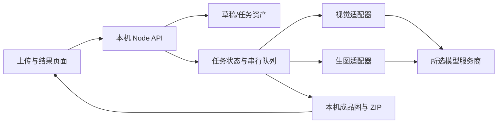

# Design

## Context

见 [proposal.md](./proposal.md) 的 Why。当前项目是静态 HTML/CSS/JS 加一个监听 `127.0.0.1` 的 Node 服务：`script.js` 在浏览器保存原图的 Blob URL，`server.js` 在内存保存各服务商 SK，并通过 OpenAI 兼容或 Claude Messages 接口生成文字。没有任务存储、图片输入、图片输出或打包下载。项目已初始化 OpenSpec，但尚未采用前端框架、数据库或云服务。

## Goals / Non-Goals

**Goals:**

- 在现有本机单用户产品中交付从原图到逐模块成品图的完整路径；任务跨页面刷新和服务重启保留。
- 让视觉理解与生图能力分别配置、分别验证；生成中的模型调用可观察、可停止后续模块、可针对失败模块重试。
- 将密钥、原图、生成结果和公开静态文件隔离，避免密钥随任务落盘。

**Non-Goals:**

- 不在本变更中迁移到 React、云对象存储、数据库或多用户身份系统。
- 不把 12 个现有文本服务商都宣称为可生图；首版生图适配以 OpenAI Images Edits 为基线，其他平台在相同适配接口下扩展。
- 不保证模型百分之百保持产品外观或事实正确；提供审阅与重试，不自动发布商品页面。

## Decisions

### 1. 单进程后台任务与本机文件存储

保留现有 Node 服务作为唯一入口，把静态文件放入 `public/`，业务代码拆为 `server/routes/`、`server/services/`、`server/providers/`。任务元数据保存在 `data/jobs/<id>/job.json`，原图和生成图存放同目录子文件夹；写元数据时先写临时文件再原子替换。任务以 UUID 标识，数据目录不作为静态目录暴露。单进程队列首版全局并发 1、模块串行执行，便于限制费用并准确归因失败。服务重启后将运行中任务标为“等待凭据”，保留完成结果；重输 SK 后可继续。

替代方案是浏览器直接同步调用或引入 Redis/数据库队列。前者会遇到浏览器超时、刷新丢进度和 SK 暴露；后者对当前本机单用户项目过重。

### 2. 草稿资产与任务快照

图片选择后上传到本机草稿目录，服务端按内容类型和实际文件签名校验，限制 6 张、每张 10 MB，并生成缩略图。草稿不触发外部模型调用；24 小时未转成任务的草稿可清理。创建任务时原图归档到任务目录，复制平台、市场、语言、质量、比例、风格、模块顺序和模型标识；SK 不复制。任务请求只引用资产 ID，不在 JSON 中反复传大体积 Base64。

替代方案是每次点击 AI 都从浏览器重新上传所有图。它实现简单，但重复传输、刷新后丢失以及失败重试难以处理。

### 3. 按能力分离模型适配器

定义 `VisionAdapter.analyze({images, brief, settings})` 和 `ImageAdapter.generate({references, moduleBrief, size, quality})` 两个接口。视觉接口首版实现 OpenAI 兼容图片输入和 Claude 原生图片块；现有其他文本预设通过“图片输入连接测试”验证后才能启用视觉角色。生图首版实现 OpenAI Images Edits，默认 GPT Image 2.5 Sunburst；旧 GPT Image 1 系列只接受固定尺寸，请求可用尺寸后在本机裁切为 4:5 或 16:9。扩展其他服务商时新增生图适配器与能力映射，不复用文本 `/chat/completions` 接口伪装生图。

模型设置页分别选择视觉角色与生图角色，展示支持的输入和输出能力、准确模型 ID、密钥状态和测试结果。SK 保留现有进程内存存储；没有 SK 的任务进入等待凭据状态。外部请求发起前在页面显示服务商、将发送的图片数量及费用提示。参考官方接口形式：[OpenAI 图像输入](https://developers.openai.com/api/docs/guides/images-vision)、[OpenAI 图片编辑](https://developers.openai.com/api/docs/guides/image-generation)、[Claude 图片块](https://platform.claude.com/docs/en/build-with-claude/vision)。

替代方案是一个统一 `callModel()` 处理文本、视觉和图片输出。各平台的生图协议、响应和限制不同，这会使配置看似通用却在运行时失败。

### 4. 任务阶段和结果模型

任务阶段为 `queued → analyzing → planning → generating → completed | partial | failed | canceled`，另有 `waiting_credentials`。每个模块持有独立状态、尝试次数、文案、结果图路径和错误摘要。视觉分析先产生商品事实与不确定项；文案规划只引用已知事实，对缺失信息标“待补充”。逐模块生图时把原图作为参考、模块文案与视觉风格作为提示。用户可只重试失败模块；取消只阻止安排后续请求，并尽力中止当前请求。

浏览器通过轮询 `GET /api/jobs/:id` 获取进度，首版无需 WebSocket。结果页可逐张下载，也可下载包含图片、文案和失败清单的 ZIP。轮询与本机串行队列足以覆盖最多 16 模块；未来并发规模增加时可替换队列实现而保留 API。

### 5. 现有页面迁移与接口边界

保留当前 UI 风格和模块选项，增加任务列表、生成进度与结果页。建议接口：`POST /api/drafts`、`POST /api/drafts/:id/images`、`DELETE /api/drafts/:id/images/:assetId`、`POST /api/assist-copy`、`POST /api/jobs`、`GET /api/jobs/:id`、`POST /api/jobs/:id/retry`、`POST /api/jobs/:id/cancel`、`GET /api/jobs/:id/export`、`DELETE /api/jobs/:id`。服务端验证输入、限制请求大小并只接受本机来源；文件路径由服务端根据 UUID 构造，不接受客户端路径。

## Risks / Trade-offs

- [高成本和长耗时] → 创建任务前显示图片数、模块数和预计调用次数；队列串行、设超时，允许取消后续模块。
- [参考图中商品外观被模型改变] → 使用编辑/参考图接口而非纯文本生图；结果必须由用户审阅，支持单模块重试。
- [模型与 API 能力持续变化] → 能力由适配器与连接测试决定，模型 ID 可编辑；失败返回类别，不自动切换到另一平台。
- [本机磁盘累积] → 提供任务删除、草稿超时清理和磁盘占用提示；结果不放在公开静态目录。
- [服务重启失去 SK] → 任务保留并标为等待凭据；重填后只继续未完成模块。
- [单进程限制吞吐量] → 首版以单用户正确性为目标，队列边界可替换，不把内存队列状态作为唯一记录。

## Migration Plan

1. 先引入资产与任务存储，但保留现有文案功能；把已有静态文件移入 `public/` 并保持当前 URL 可用。
2. 引入视觉分析适配器，使“AI 帮写”使用原图，并在不支持图片输入时给出明确错误。
3. 增加单一生图适配器和逐模块队列；将原“本地预览”替换为任务结果页，旧行为仅作为无模型时的演示提示。
4. 加入重试、取消、导出与删除。迁移前的页面临时 Blob 图片无法恢复，提示用户重新上传；既有模型配置在服务重启后按当前规则重填。

回滚时停用新任务入口，保留 `data/jobs` 目录供手工恢复或导出；不删除已生成资产。项目目前不是 Git 仓库，实施前应建立版本控制或保留可恢复快照。
